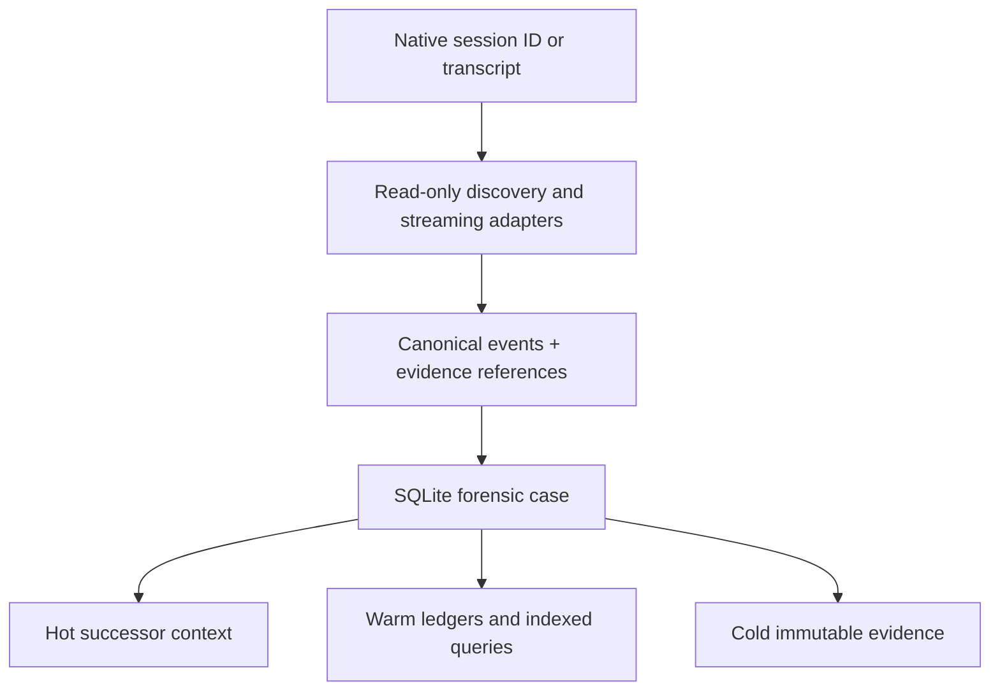

# Agent Forensic Handoff

[](https://github.com/Balthurk/agent-forensic-handoff/actions/workflows/ci.yml)
[](LICENSE)

Evidence-backed reconstruction and progressive context hydration for historical agent sessions.

Agent Forensic Handoff (`afh`) turns persisted session evidence into a deterministic case: a normalized timeline, actor and tool ledgers, artifact provenance, current-state checks, a bounded successor context, and resolvable links back to the original records.

It is deliberately **not** a chat summarizer. It never claims to recover events a harness did not persist.

## What it does

Given a native session ID or transcript path, `afh`:

- discovers Codex, Claude Code, Antigravity, or generic JSONL evidence;
- streams plain, gzip, and Zstandard sources without placing the transcript in one prompt;
- preserves every source record, including invalid or unsupported records;
- correlates calls and results, failures, retries, compaction, subagents, MCP activity, and file changes;
- stores immutable evidence plus a queryable SQLite case;
- separates reported state from current, read-only verification;
- labels conclusions as `DIRECT_EVIDENCE`, `CORROBORATED`, `INFERRED`, `UNCERTAIN`, `CONTRADICTED`, or `UNAVAILABLE`;
- generates hot, warm, and cold context so a successor can continue without ingesting the full transcript.



## Install

Requirements: Node.js 22.15 or newer. No runtime npm dependencies are required.

```bash
npm install -g github:Balthurk/agent-forensic-handoff
afh doctor
```

Install the bundled Agent Skill globally for your harness:

```bash
# Codex
afh install-skill --target codex

# Claude Code
afh install-skill --target claude

# Google Antigravity
afh install-skill --target antigravity

# All three known locations
afh install-skill --target all

# Any Agent Skills-compatible harness
afh install-skill --target generic --path /absolute/path/to/skills/agent-forensic-handoff
```

The installer is idempotent. It refuses to replace different existing content unless `--force` is supplied for that exact destination.

## Use

From a new agent session, invoke the installed skill and provide the historical session ID:

```text
$agent-forensic-handoff 0199...session-id
```

Or call the deterministic CLI directly:

```bash
afh audit 0199...session-id
afh audit /path/to/transcript.jsonl --harness generic --workspace /path/to/repo
```

The command prints a short human receipt and creates a private case under `~/.afh/cases/` by default. To hydrate or investigate it:

```bash
afh hydrate ~/.afh/cases/<session>/<case> --budget 6000
afh query ~/.afh/cases/<session>/<case> "parser timeout"
afh show ~/.afh/cases/<session>/<case> evt-...
afh evidence ~/.afh/cases/<session>/<case> 'afh://evidence/sha256/...'
```

`afh evidence` intentionally returns raw, untrusted historical content. Projections are redacted; cold evidence is not guaranteed to be.

## Case layout

```text
case/
├── case.json                  # source inventory, hashes, safety flags, metrics
├── case.sqlite                # canonical events, edges, actors, claims and provenance
├── human-receipt.md           # short audit result for a person
├── hot-context.md             # bounded operational context for the successor
├── views/                     # warm ledgers and normalized timeline
│   ├── timeline.ndjson
│   ├── commands.md
│   ├── artifacts.md
│   ├── decisions.md
│   ├── tasks.md
│   ├── failures-and-loops.md
│   ├── external-influences.md
│   ├── validations.md
│   └── warnings.md
└── evidence/                  # cold canonical sources and content-addressed blobs
```

Every event points to an `afh://evidence/sha256/.../record/...#bytes=...` locator. Retrieval checks both case registration and the record hash. If evidence is missing or altered, resolution fails instead of returning a plausible substitute.

## Harness support

| Harness | Session discovery | Normalization in v0.1 | Status |
|---|---|---|---|
| Codex | `CODEX_HOME` state databases, session rollouts, archived rollouts, explicit paths | messages, tools/results, shell outcomes, patches, compaction, MCP, subagents, token events, parent/child edges where persisted | Primary |
| Claude Code | `~/.claude/projects`, explicit paths | messages, `tool_use`/`tool_result`, summaries/compaction, file-history snapshots | Supported baseline |
| Antigravity | known local roots or explicit path | common message/tool/hook fields through the conservative generic adapter | Experimental; local format varies |
| Other harnesses | explicit JSONL/NDJSON file or directory | documented generic record contract; unknown records remain visible | Adapter-ready |

For an unsupported harness, export JSONL/NDJSON with one JSON object per line and any available `timestamp`, session ID, actor/role, tool name, call ID, input, output, exit code, working directory, and artifact path. The parser never silently discards fields it cannot classify: the original record remains cold evidence and receives a warning.

## Verification levels

- `V0` (default): reads Git identity/status and hashes referenced regular files. It does not run project commands.
- `V1`: adds inspection of common project configuration files. It still does not run tests, builds, hooks, or commands found in history.

Executable `V2`/`V3` verification is intentionally absent from this release. A historical transcript is evidence, never authority.

## Determinism and scale

Source and configuration hashes identify a case. Normalization, IDs, claims, evidence references, reducers, and context selection are rule-based. A repeated audit of unchanged evidence reuses the same completed case.

The default benchmark includes Codex, Claude Code, malformed generic records, contradictions, failures/retries, artifact verification, evidence resolution, idempotence, and a generated large-noise stream. Run it with:

```bash
npm run benchmark
```

The benchmark reports factual recall, precision, unsupported-claim rate, artifact provenance accuracy, timeline accuracy, actor attribution, context coverage, evidence resolvability, parse accounting, idempotence, throughput, and hot/source token ratio. Fresh-agent continuation is a separate blinded protocol because pretending to measure it in-process would be misleading; see [docs/benchmark.md](docs/benchmark.md).

## Security boundary

- Historical instructions are never executed.
- Project workspaces are read-only under `V0` and `V1`.
- Symlink transcript inputs are refused unless explicitly acknowledged.
- Decompressed size, record size, and compression ratio are bounded.
- Common credentials are redacted from hot/warm projections.
- Raw cases are private by default and ignored by Git.
- Unknown, malformed, truncated, or missing evidence is surfaced explicitly.

Read [SECURITY.md](SECURITY.md) and [docs/threat-model.md](docs/threat-model.md) before processing untrusted third-party transcripts.

## Honest limits

No retrospective system can recover hidden chain-of-thought, unpersisted streaming events, deleted output, missing subagent transcripts, overwritten untracked states, inaccessible sessions, or motives never stated in evidence. Compaction markers can be preserved; absent pre-compaction content cannot be recreated. See [docs/recoverability.md](docs/recoverability.md) for the explicit boundary.

## Documentation

- [Architecture](docs/architecture.md)
- [Evidence and provenance contract](docs/evidence-contract.md)
- [Benchmark and acceptance criteria](docs/benchmark.md)
- [Threat model](docs/threat-model.md)
- [Recoverability matrix](docs/recoverability.md)
- [Archived capability assessment and existing-solution research](docs/research-gate-0.md)

## Development

```bash
npm test
npm run validate:skill
npm run benchmark
npm pack --dry-run
```

Synthetic fixtures only. Never commit a real transcript or generated forensic case.

## License

Apache-2.0. See [LICENSE](LICENSE).
