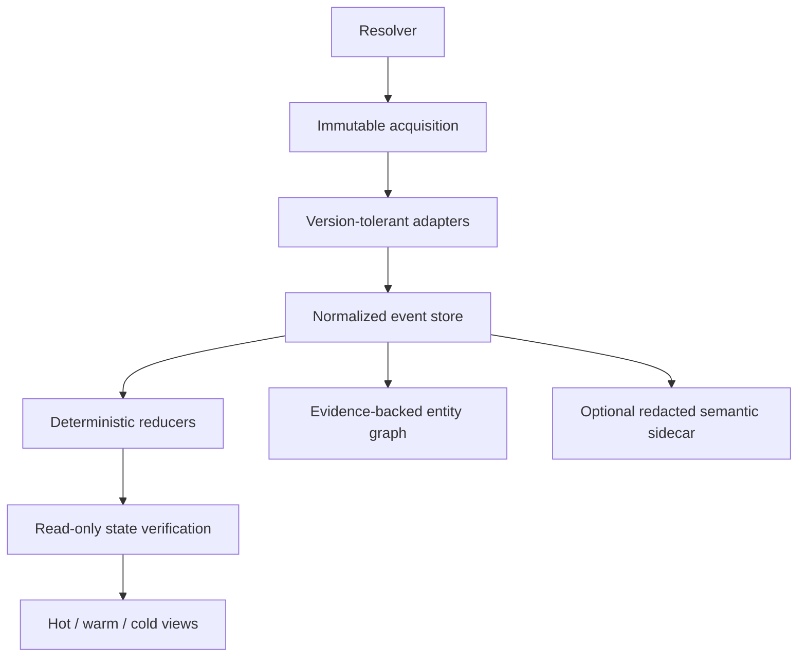

# Architecture

## Product contract

Agent Forensic Handoff is **evidence-complete within the observable boundary**: it accounts for every record it can read, preserves unsupported records, and refuses to fill source gaps with plausible narrative. It cannot be complete beyond what a harness persisted and the operator can access.

The executable core is independent of any model. Agent Skills are thin operating instructions that invoke the same CLI and consume the same case format.

## Pipeline

1. **Resolve.** An exact ID or path resolves to one or more source files and explicit session edges. Ambiguity fails closed.
2. **Acquire.** Freeze each source at its observed byte length, hash and decode only that prefix, verify the prefix remained stable, enforce resource limits, and write the exact decoded records into a private canonical source file.
3. **Normalize.** Harness adapters emit typed events, actors, sessions, call IDs, artifacts, timestamps, and evidence pointers. Invalid and unknown records become first-class forensic events.
4. **Reduce.** Rule-based joins build tool executions, explicit correlation edges, mission/task claims, decisions with explicit markers, retry fingerprints, and artifact revision chains.
5. **Verify.** `V0` observes Git metadata and referenced file hashes. `V1` additionally inventories common project configuration. Neither runs project code.
6. **Project.** Schema-v3 reducers create conservative evidence-bearing graph edges. An optional copy-on-write sidecar stores redacted preview chunks and deduplicated local embeddings bound to an exact case/model/config identity.
7. **Render.** A bounded hot context supports immediate continuation; warm ledgers support focused inspection; cold evidence provides exact source records.

## Why SQLite and content-addressed evidence

SQLite is justified by the need to correlate thousands or millions of events without placing them in a prompt. It supplies transactions, indexed joins, FTS retrieval, deterministic ordering, and a single portable case file without a service. Content hashes make source identity, artifact revision identity, tamper detection, and idempotent caching explicit.

The database stores projections, normalized value hashes, and references. Full transcript values remain recoverable from exact canonical-source byte ranges rather than being duplicated as event blobs. Small derived values such as captured diffs are packed into SQLite; large derived values remain content-addressed files. This avoids duplicating transcript payloads and avoids creating thousands of tiny files.

## Canonical data model

| Entity | Purpose | Principal links |
|---|---|---|
| `source` / `source_record` | Inventory and parse accounting | native URI, original/canonical hash, ordinal, byte range |
| `session` / `session_edge` | Native session topology | parent, child, fork/spawn evidence |
| `actor` | Attribution | user, agent, subagent, tool, MCP, hook, automation, CI, external service |
| `event` / `event_edge` | Ordered observable occurrences | source record, actor, call/turn IDs, explicit result edges |
| `entity_edge` | Cross-entity provenance graph | typed endpoints, named rule, grade, epistemic status, evidence event |
| `evidence_ref` | Backward traceability | stable URI, record hash, optional JSON pointer |
| `tool_execution` | Correlated command/tool ledger | request, result, status, exit, semantic extract, fingerprint |
| `artifact` / `artifact_revision` | Provenance and current status | producing event, predecessor, content/diff hash |
| `claim` / `decision_record` / `task` | Mission and decision state | evidence, derivation rule, epistemic status |
| `state_snapshot` / `validation` | Reported-vs-observed checks | workspace, Git, file hash, freshness |
| `content_blob` | Deduplicated derived content | hash, length, SQLite/file storage locator |
| `hydration_pack` | Bounded successor projection | case hash, token budget, selected event IDs |

The normative SQL is [src/schema.sql](../src/schema.sql); the public event interchange shape is [schemas/event.schema.json](../schemas/event.schema.json).

## Ordering and causality

Ordering uses explicit timestamps where present and stable `(source_id, record_ordinal, subordinal)` order otherwise. Timestamp precision is retained. Concurrent events with equal/absent timestamps are not given a fabricated total causal order.

Schema-v3 causal edges remain intentionally sparse: call/result pairs use shared native call IDs; session topology uses state-store edges or exact native IDs returned by successful `create_thread`, `fork_thread`, or observed subagent-start records. Artifact production/modification, validation, supersession, and contradiction edges carry their rule, grade, epistemic state, and evidence event. Temporal proximity is available for inspection but is not stored as fact. Traversal is cycle-safe and bounded by hop/node limits.

## Hybrid retrieval projection

FTS5 remains the exact, deterministic default. The optional semantic layer uses local Transformers.js embeddings and sqlite-vec in a separate SQLite sidecar. It embeds only already-redacted event preview text, deduplicates identical content hashes, maps every occurrence back to an event/evidence URI, and never writes semantic inference into the authoritative case ledger. Normal inference disables remote model access.

Semantic mode performs cosine KNN with an explicit minimum similarity. Hybrid mode combines lexical and vector ranks using deterministic reciprocal-rank fusion and may add bounded graph neighbors. Receipts expose the effective mode, query hash, filters, case/projection/model identity, coverage, candidate counts, graph expansion, result IDs, and explicit fallback. Scores are retrieval relevance only.

## Adapter boundary

Adapters map source-specific records into one normalized structure. They must:

- never drop a source record silently;
- preserve the source ordinal and pointer;
- avoid fabricating timestamps or actors;
- emit direct status only for explicit fields;
- keep unknown fields recoverable in cold evidence;
- add fixtures for every supported format/version family.

Codex and Claude have dedicated normalizers. Antigravity and unknown harnesses currently use a conservative common-field adapter. This is honest portability: a shared kernel and installable skill, not a false claim that all proprietary transcript schemas are identical.

## Idempotence

Event, actor, revision, claim, and evidence IDs derive from normalized identities and cryptographic hashes. The case hash derives from source hashes, schema version, and semantic configuration. A completed matching case is reused; reducers contain no model sampling.

A case is also a time-scoped verification snapshot. If the workspace changes later, its historical validation does not magically refresh. Re-audit into a new explicit case directory or perform current read-only checks before continuation; never rewrite the old observation as though it happened earlier.

## Deliberate omissions in v0.3

- no cloud service, remote embedding provider, standalone vector database, or mandatory MCP server;
- no LLM parsing/enrichment in the factual path;
- no automatic App Server launch;
- no execution-capable verification level;
- no encrypted portable bundle yet;
- no claim that raw private harness formats are stable APIs.

These omissions reduce attack surface and let the forensic contract be tested before adding convenience layers.
